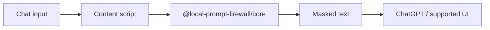

<div align="center">
  
</div>

<p align="center">
  
</p>

<p align="center">
  <strong>Local-first Chrome extension</strong> that detects and masks sensitive text<br/>
  before a prompt is sent to ChatGPT or other supported chat UIs.
</p>

<p align="center">
  <a href="#-why">Why</a> ·
  <a href="#-features">Features</a> ·
  <a href="#-how-it-works">How it works</a> ·
  <a href="#-install">Install</a> ·
  <a href="#-development">Development</a> ·
  <a href="#-security">Security</a>
</p>

<p align="center">
  <a href="LICENSE"></a>
  
  
  
  
</p>

<p align="center">
  
  
  
  
  
</p>

---

## ✨ Why

> *The prompt box is the easiest place to leak a secret.*

People paste API keys, emails, tokens and customer data into LLM chats. Cloud prompt scanners solve that by sending the same text to yet another server. This extension never does.

| Pain | What the firewall does |
| :--- | :--- |
| Secrets land in ChatGPT history | Detects common patterns and masks them in the input |
| SaaS DLP wants your prompt | Matching runs **only in the browser** |
| One regex is never enough | Custom rules, first-match wins |
| Hard to test a new rule | Options page includes a live pattern tester |

The extension only looks at text you type into supported chat inputs. Nothing is uploaded or logged remotely.

## 🧩 Features

<table>
  <tr>
    <td width="50%"><h3>🔍 Built-in patterns</h3>Emails, keys and other common secrets out of the box.</td>
    <td width="50%"><h3>🧩 Custom regex</h3>Add your own rules. First match wins. Case-sensitive by default.</td>
  </tr>
  <tr>
    <td><h3>🖥 Options page</h3>Enable rules, edit patterns, test them before saving.</td>
    <td><h3>🔒 On-device only</h3>Firewall logic makes no remote calls. Analysis never leaves the tab.</td>
  </tr>
</table>

## 🛠 How it works



1. Content script reads the composer text.
2. Core package runs built-in + custom patterns in order.
3. First hit is masked before the prompt is submitted.
4. After saving new patterns, reload the extension or refresh the tab.

After install, grant host permissions for ChatGPT (or other target domains). Without them the extension looks idle.

## 📦 Install

```bash
git clone https://github.com/awhite0030/local-prompt-firewall.git
cd local-prompt-firewall
npm install
npm run build
```

Then in Chrome: `chrome://extensions` → Developer mode → Load unpacked → select the built `dist` from the Chrome extension workspace.

## 🧪 Development

Requires Node.js 20+.

```text
local-prompt-firewall/
├── apps/chrome-extension/     # Vite + MV3 extension
├── packages/                  # shared core matcher
├── docs/
├── SECURITY.md
└── package.json
```

```bash
npm run build
npm test
npm run typecheck
```

## 🔐 Security

See [SECURITY.md](SECURITY.md). This is a local guardrail, not a substitute for corporate DLP. Do not paste production secrets into a chat box even with the extension enabled.

## 🤝 Contributing

PRs welcome. Start with [CONTRIBUTING.md](CONTRIBUTING.md) and the [Code of Conduct](CODE_OF_CONDUCT.md).

## 📄 License

[Apache-2.0](LICENSE) © 2026 Local Prompt Firewall contributors

<div align="center">
  
</div>
